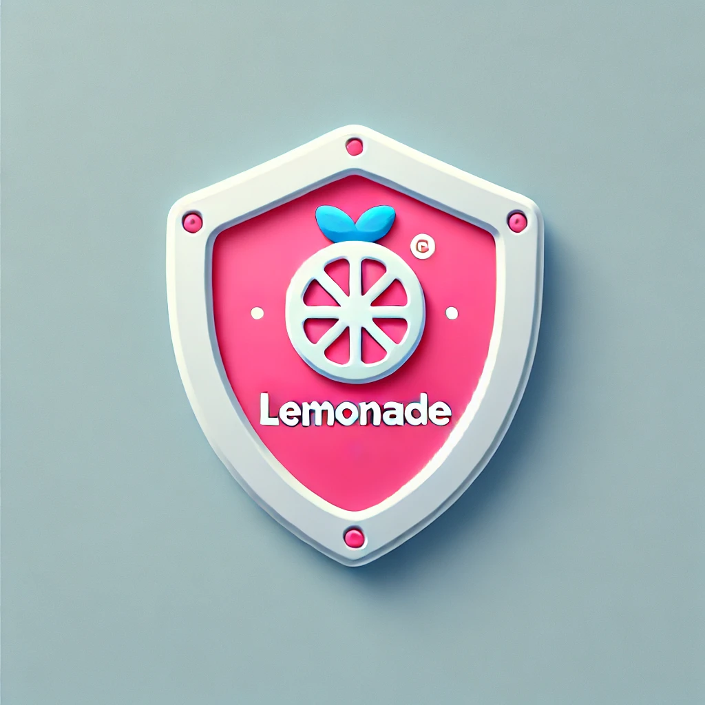

  

# **Lemonade Cybersecurity Program Proposal**

## **Overview**
This repository contains a comprehensive cybersecurity program proposal for Lemonade, developed by the **CyberGuardians** team during the WiCyS Cybersecurity Sprint. The proposal addresses key areas such as risk management, AI security, and incident response to enhance Lemonade's overall security posture.

---

## **Key Sections**

1. **Introduction**: Provides an overview of Lemonade’s cybersecurity needs, objectives, and alignment with business goals.
2. **Risks & Challenges**: Identifies key threats, including AI manipulation, data breaches, third-party vulnerabilities, and ransomware attacks.
3. **Proposed Solutions**: Outlines solutions such as AI audits, data encryption, employee training, and a comprehensive incident response plan.
4. **Strategic Roadmap**: Details the milestones, phases, and timelines for the implementation of the cybersecurity program.
5. **KPIs & Future-Proofing**: Describes key performance indicators (KPIs) for measuring success and a strategy for scalable, long-term security.

---

## **Visuals**
- **Risk Heatmap**: Visualizes the likelihood and impact of identified risks.
- **Timeline & Milestones**: Provides a Gantt chart of the implementation phases.
- **Budget Breakdown**: Pie chart detailing the allocation of resources.

---

## **Contact Information**
For any inquiries or collaboration opportunities, please contact Dr. Alexis at info@alexiscollier.com
